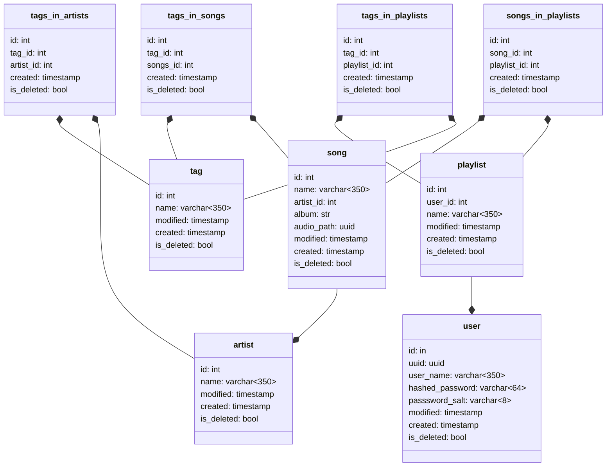

# Playlists with Flask

```mermaid
classDiagram
    class user{
        id: in
        uuid: uuid
        user_name: varchar<350>
        hashed_password: varchar<64>
        passsword_salt: varchar<8>
        modified: timestamp
        created: timestamp
        is_deleted: bool
    }

    class playlist{
        id: int
        user_id: int
        name: varchar<350>
        modified: timestamp
        created: timestamp
        is_deleted: bool
    }

    class song{
        id: int
        name: varchar<350>
        artist_id: int
        album: str
        audio_path: uuid
        modified: timestamp
        created: timestamp
        is_deleted: bool
    }

    class artist{
        id: int
        name: varchar<350>
        modified: timestamp
        created: timestamp
        is_deleted: bool
    }

    class tag{
        id: int
        name: varchar<350>
        modified: timestamp
        created: timestamp
        is_deleted: bool
    }

    class tags_in_artists{
        id: int
        tag_id: int
        artist_id: int
        created: timestamp
        is_deleted: bool
    }

    class tags_in_songs{
        id: int
        tag_id: int
        songs_id: int
        created: timestamp
        is_deleted: bool
    }

    class tags_in_playlists{
        id: int
        tag_id: int
        playlist_id: int
        created: timestamp
        is_deleted: bool
    }

    class songs_in_playlists{
        id: int
        song_id: int
        playlist_id: int
        created: timestamp
        is_deleted: bool
    }

    tags_in_playlists *-- playlist
    tags_in_playlists *-- tag

    tags_in_songs *-- tag
    tags_in_songs *-- song

    tags_in_artists *-- tag
    tags_in_artists *-- artist

    songs_in_playlists *-- song
    songs_in_playlists *-- playlist

    playlist --* user
    song --* artist
```
