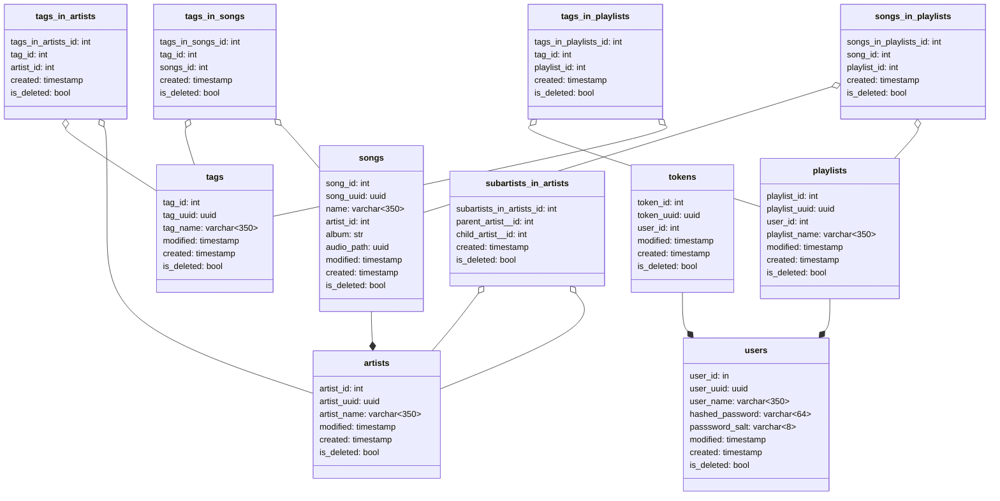
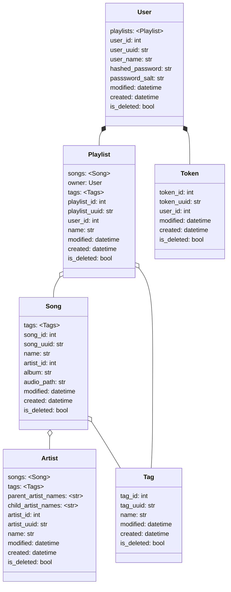

# Playlists with Flask

## Database diagram

```mermaid
classDiagram
    class users{
        user_id: in
        user_uuid: uuid
        user_name: varchar<350>
        hashed_password: varchar<64>
        passsword_salt: varchar<8>
        modified: timestamp
        created: timestamp
        is_deleted: bool
    }

    class playlists{
        playlist_id: int
        playlist_uuid: uuid
        user_id: int
        playlist_name: varchar<350>
        modified: timestamp
        created: timestamp
        is_deleted: bool
    }

    class songs{
        song_id: int
        song_uuid: uuid
        name: varchar<350>
        artist_id: int
        album: str
        audio_path: uuid
        modified: timestamp
        created: timestamp
        is_deleted: bool
    }

    class artists{
        artist_id: int
        artist_uuid: uuid
        artist_name: varchar<350>
        modified: timestamp
        created: timestamp
        is_deleted: bool
    }

    class tags{
        tag_id: int
        tag_uuid: uuid
        tag_name: varchar<350>
        modified: timestamp
        created: timestamp
        is_deleted: bool
    }

    class tags_in_artists{
        tags_in_artists_id: int
        tag_id: int
        artist_id: int
        created: timestamp
        is_deleted: bool
    }

    class tags_in_songs{
        tags_in_songs_id: int
        tag_id: int
        songs_id: int
        created: timestamp
        is_deleted: bool
    }

    class tags_in_playlists{
        tags_in_playlists_id: int
        tag_id: int
        playlist_id: int
        created: timestamp
        is_deleted: bool
    }

    class songs_in_playlists{
        songs_in_playlists_id: int
        song_id: int
        playlist_id: int
        created: timestamp
        is_deleted: bool
    }

    class subartists_in_artists{
        subartists_in_artists_id: int
        parent_artist__id: int
        child_artist__id: int
        created: timestamp
        is_deleted: bool
    }

    class tokens{
        token_id: int
        token_uuid: uuid
        user_id: int
        modified: timestamp
        created: timestamp
        is_deleted: bool
    }

    tags_in_playlists o-- playlists
    tags_in_playlists o-- tags

    tags_in_songs o-- tags
    tags_in_songs o-- songs

    tags_in_artists o-- tags
    tags_in_artists o-- artists

    songs_in_playlists o-- songs
    songs_in_playlists o-- playlists

    subartists_in_artists o-- artists
    subartists_in_artists o-- artists

    playlists --* users
    songs --* artists
    tokens --* users
```

## Models diagram

```mermaid
classDiagram
    class User{
        playlists: ~Playlist~

        user_id: int
        user_uuid: str
        user_name: str
        hashed_password: str
        passsword_salt: str
        modified: datetime
        created: datetime
        is_deleted: bool
    }

    class Playlist{
        songs: ~Song~
        owner: User
        tags: ~Tags~

        playlist_id: int
        playlist_uuid: str
        user_id: int
        name: str
        modified: datetime
        created: datetime
        is_deleted: bool
    }

    class Song{
        tags: ~Tags~

        song_id: int
        song_uuid: str
        name: str
        artist_id: int
        album: str
        audio_path: str
        modified: datetime
        created: datetime
        is_deleted: bool
    }

    class Artist{
        songs: ~Song~
        tags: ~Tags~
        parent_artist_names: ~str~        
        child_artist_names: ~str~        

        artist_id: int
        artist_uuid: str
        name: str
        modified: datetime
        created: datetime
        is_deleted: bool
    }

    class Tag{
        tag_id: int
        tag_uuid: str
        name: str
        modified: datetime
        created: datetime
        is_deleted: bool
    }

    class Token{
        token_id: int
        token_uuid: str
        user_id: int
        modified: datetime
        created: datetime
        is_deleted: bool
    }

    User *-- Playlist
    User *-- Token
    Playlist o-- Song
    Song o-- Artist
    Song o-- Tag
    Playlist o-- Tag
```
