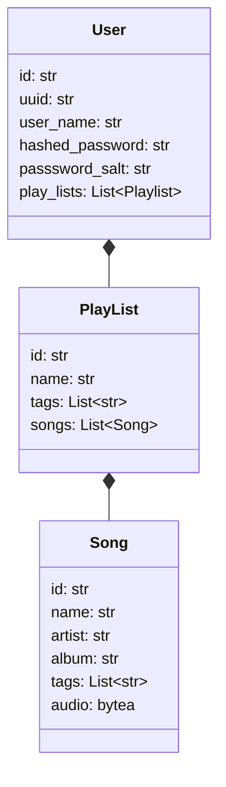

# Playlists with Flask

```mermaid
classDiagram
    class User{
        id: str
        uuid: str
        user_name: str
        hashed_password: str
        passsword_salt: str
        play_lists: List~Playlist~
    }

    class PlayList{
        id: str
        name: str
        tags: List~str~
        songs: List~Song~
    }

    class Song{
        id: str
        name: str
        artist: str
        album: str
        tags: List~str~
        audio: bytea
    }

    User *-- PlayList
    PlayList *-- Song
```
