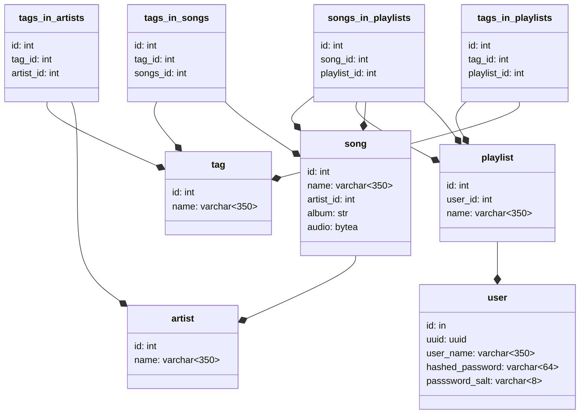

# Playlists with Flask

The audio is stored as bytes in this diagram. Would it be better to store the audio as a file and then store the url?

```mermaid
classDiagram
    class user{
        id: in
        uuid: uuid
        user_name: varchar<350>
        hashed_password: varchar<64>
        passsword_salt: varchar<8>
    }

    class playlist{
        id: int
        user_id: int
        name: varchar<350>
    }

    class song{
        id: int
        name: varchar<350>
        artist_id: int
        album: str
        audio: bytea
    }

    class artist{
        id: int
        name: varchar<350>
    }

    class tag{
        id: int
        name: varchar<350>
    }

    class tags_in_artists{
        id: int
        tag_id: int
        artist_id: int
    }

    class tags_in_songs{
        id: int
        tag_id: int
        songs_id: int
    }

    class tags_in_playlists{
        id: int
        tag_id: int
        playlist_id: int
    }

    class songs_in_playlists{
        id: int
        song_id: int
        playlist_id: int
    }

    songs_in_playlists --* song
    songs_in_playlists --* playlist

    tags_in_playlists --* playlist
    tags_in_playlists --* tag

    tags_in_songs --* tag
    tags_in_songs --* song

    tags_in_artists --* tag
    tags_in_artists --* artist

    songs_in_playlists --* song
    songs_in_playlists --* playlist

    playlist --* user
    song --* artist
```
